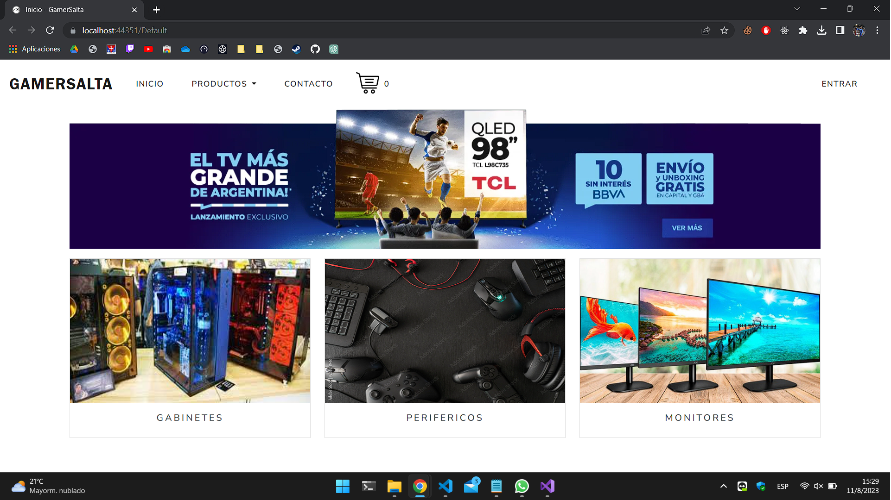
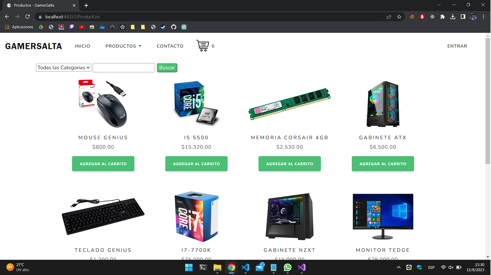
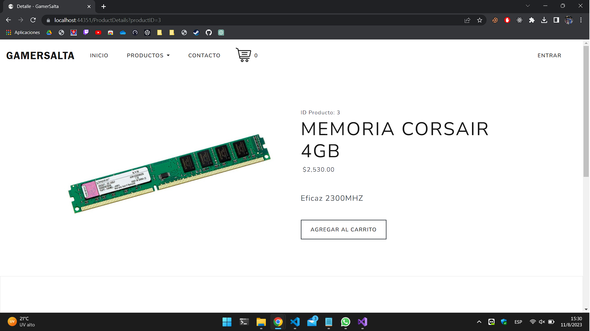

# Proyecto ASP.NET con SQL Server - Guía de Configuración

Este repositorio contiene un proyecto desarrollado en ASP.NET que utiliza SQL Server como base de datos. A continuación, se detallan los pasos necesarios para configurar, compilar y ejecutar el proyecto en tu entorno local.

## Requisitos Previos

Antes de comenzar, asegúrate de tener instalados los siguientes elementos en tu máquina:
- [Visual Studio](https://visualstudio.microsoft.com/) (versión recomendada: 2019 o superior)
- [SQL Server](https://www.microsoft.com/en-us/sql-server/sql-server-downloads)
- Conocimiento básico de ASP.NET y SQL Server

## Pasos de Configuración

Sigue estos pasos para configurar y ejecutar el proyecto en tu entorno local:

1. **Clonar el Repositorio:** Comienza clonando este repositorio en tu máquina local utilizando el comando `git clone`.

2. **Configurar la Cadena de Conexión:** Abre el archivo `Web.config` en la raíz del proyecto y busca la sección `<connectionStrings>`. Reemplaza la cadena de conexión existente con los detalles de tu instancia de SQL Server:

    ```xml
    <connectionStrings>
        <add name="DefaultConnection" connectionString="Data Source=NombreDelServidor;Initial Catalog=NombreDeLaBaseDeDatos;Integrated Security=True;" providerName="System.Data.SqlClient" />
    </connectionStrings>
    ```

    Asegúrate de cambiar `NombreDelServidor` y `NombreDeLaBaseDeDatos` por los valores correctos.

3. **Agregar Migración:** Abre la Consola del Administrador de Paquetes en Visual Studio (`Herramientas > Administrador de Paquetes NuGet > Consola del Administrador de Paquetes`) y ejecuta el siguiente comando para crear una migración:

    ```
    Add-Migration NombreDeLaMigracion
    ```

    Reemplaza `NombreDeLaMigracion` por un nombre descriptivo para la migración.

4. **Aplicar Migración:** Una vez creada la migración, ejecuta el siguiente comando para aplicarla a la base de datos:

    ```
    Update-Database
    ```

    Esto creará las tablas necesarias en tu base de datos de SQL Server.

5. **Recompilar la Solución:** Abre la solución en Visual Studio y realiza una compilación completa del proyecto para asegurarte de que no haya errores.

6. **Ejecutar el Proyecto:** Ahora estás listo para ejecutar el proyecto. Presiona el botón de ejecución (IIS Express) en la barra de herramientas de Visual Studio.







